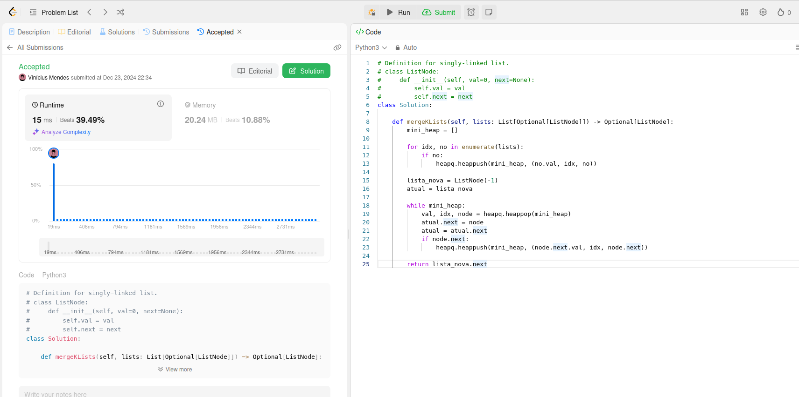
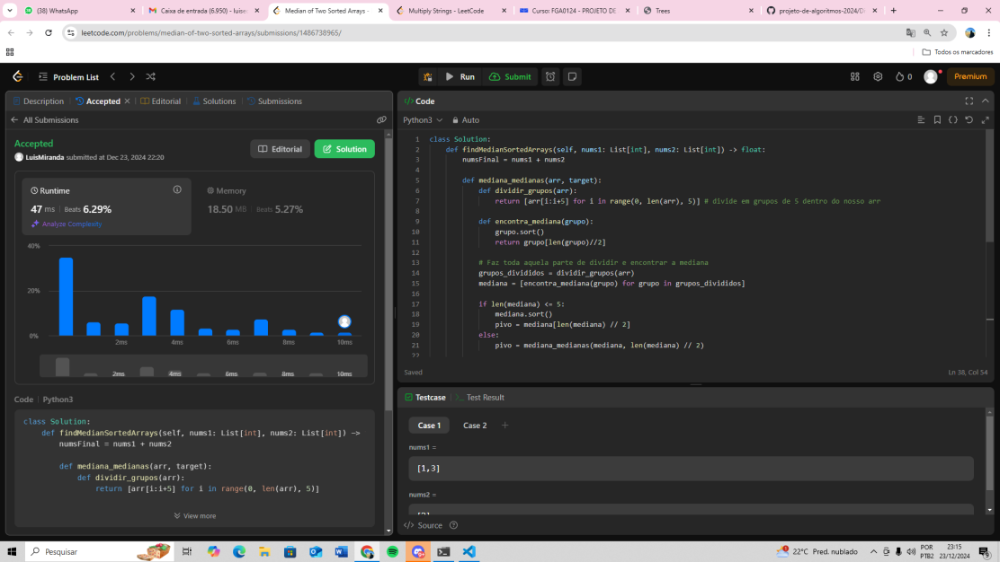
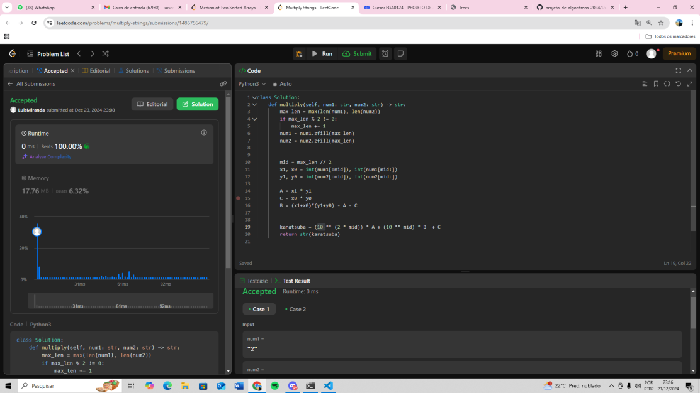

# Dividir e Conquistar_LeetCode-Challenges

Questões de Dividir e Consquistar resolvidas no LeetCode pelos alunos Luis Miranda e Vinicius Mendes

**Número da Lista**: 3
**Conteúdo da Disciplina**: Algoritmos de Dividir e Conesquistar

## Alunos
|Matrícula | Aluno |
| -- | -- |
| 21/1063200  |  LUIS EDUARDO CARNEIRO MIRANDA |
| 21/1063265 |  VINICIUS MENDES MARTINS |

## Sobre 
Resolução de questões da plataforma LeetCode que contemplam os níveis médio e difícil de dificuldade.
O objetivo é abordar o conteúdo lecionado em sala de aula de forma simples e intuitiva, com códigos facilmente legíveis.

Os exercícios abordados são os seguintes
| Código do Problema | Nome do Problema | Dificuldade |
| ------------------ | ---------------- | ----------- |
| [23](https://leetcode.com/problems/merge-k-sorted-lists/description/) | Merge k Sorted Lists| Dificil |
| [4](https://leetcode.com/problems/median-of-two-sorted-arrays/description/) | Median of Two Sorted Arrays| Difícil |
| [43](https://leetcode.com/problems/multiply-strings/description/) | Multiply Strings | Média |

## Screenshots
 
### Merge k Sorted Lists

### Median of Two Sorted Arrays

### Multiply Strings

## Vídeo explicando cada questão

| Problema |
| ------------------ |
| [23. Merge k Sorted Lists](https://youtu.be/XXGN11UpCCY)| 
| [4. Median of Two Sorted Arrays](https://youtu.be/Qana4pHWjps)| 
| [43. Multiply Strings](https://youtu.be/z9emiNrRaeA) |

## Instalação 
**Linguagem**: Python

## Uso 
Para testar os códigos, basta entrar na plataforma [LeetCode](https://leetcode.com/), procurar pelos exercícios e colar na aba Code.
